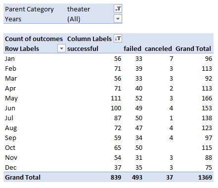
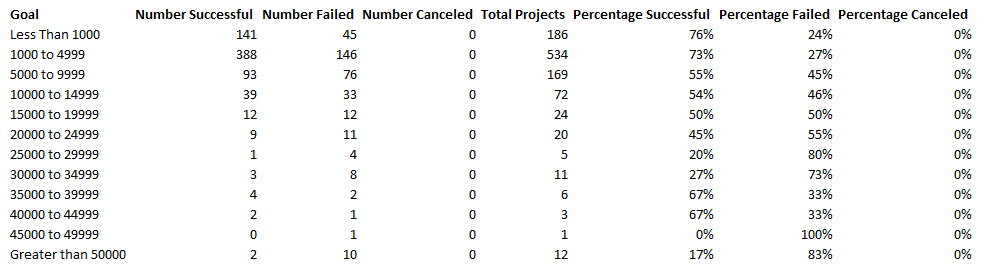
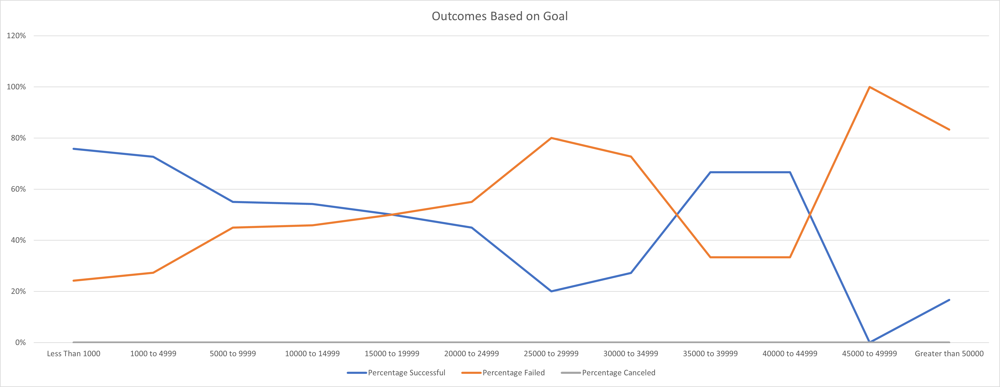

# Kickstarting with Excel

## Overview of Project

### Background and Purpose

Kickstarter is a platform where ambitious creators can post information about a project they need funded. Donations are made to these projects, and if they meet a certain goal, the money is awarded to the creator for the purpose of completing the project. There are a number of reasons a Kickstarter campaign may succeed or fail, so the purpose of this analysis was to find what factors of a Kickstarter project might influence its fate.

## Analysis and Challenges

### Analysis of Outcomes Based on Launch Date

To analyze the fates of kickstarter projects for plays based on their launch date, a pivot table was created. The data was filtered to only include theater projects, and the data was displayed in such a way that displayed the number of sucessful, failed, and canceled projects by month. The data could be filtered by year if desired, but the overall analysis was done using all years. The resulting pivot table and chart are shown below.

Overall, the months with the greatest number of successful campaigns occurred between April and August. May in particular was a good month for theater-related Kickstarter projects with 111 successful attempts and only 52 failures. May was easily the month with the greatest success rate as well, as roughly two thirds of all theater projects launched in this month succeeded. On the other hand, December was the worst month to launch a campaign with a concerning 49% success rate.

### Analysis of Outcomes Based on Goals

Plays were then singled out and analyzed specifically to see if the project's goal amount had any influence on success. Every project was sorted into bins at increments of $5000, plus additional bins for Less than $1000 and Greater than $50000. The number of successful, failed, and canceled projects with goal amounts were sorted into their proper bins and plotted on a line graph, shown below.

For the bottom half of goal amounts, the success rate of Kickstarter projects for plays steadily decreases with increasing goal amount. This is intuitive, as the more money necessary to fund a project, the more room for error when securing that money. At goal amounts of $25000 and above, the trend is a bit more erratic. The sample size of these bins starts to drop off significantly at the higher goal amounts, so the success rate at these goal amounts may not be indicative of the overall trend. For example, it would be irresponsible to conclude that since the only project with a goal amount between $45000 and $49999 failed, any project with a goal amount in that range will also fail. Interestingly, no projects in this analysis were canceled.

### Challenges and Difficulties Encountered

I had never previously seen the datetime format originally provided in the dataset. I am familiar with Excel's datetime, so working with the temporal data became much easier once the original timestamps were converted.

## Results

- What are two conclusions you can draw about the Outcomes based on Launch Date?

Theater projects are most likely to succeed if they are launched in May.

Theater projects are most likely to fail if they are launched in December.

- What can you conclude about the Outcomes based on Goals?

The success rate a play project is inversely proportional to the project's goal amount. This may not hold true for projects with outstandingly high goal amounts, as their insufficient data to make that conclusion.

- What are some limitations of this dataset?

Having no canceled projects for plays in the Outcomes Based on Goals analysis gives us no information about what might cause such a project to get canceled. The fact that none have been canceled yet does not mean that a launched kickstarter project will be seen to completion, so we cannot avoid what might be identified as pitfalls of canceled projects.

The small sample size of projects for plays with high goal amounts means any conclusions drawn from those samples are less reliable.

- What are some other possible tables and/or graphs that we could create?

One additional bit of analysis that could be completed is looking at the success rate of projects by country. Are certain types of projects more likely to succeed in some countries and fail in others? Is the overall success rate by country varied or uniform?

It would also be interesting to look at some of the factors that cause a project to be canceled. Were most canceled projects pretty far from reaching their goal, or did some fall just short? Were they canceled close to the deadline or not long into their run?
